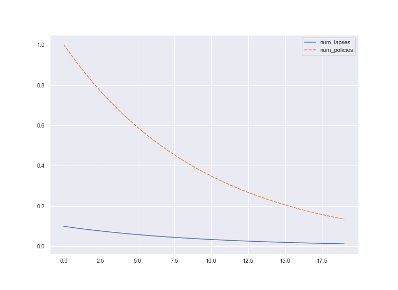

## Welcome to DigitalActuary

DigitalActuary is the home page for `heavymodel`, a python based actuarial modelling library.

My intention is to release the library as open source software, however as `heavymodel` is currently in closed beta, if you would like to test it or have any questions please contact me (Lewis Fogden) via:

- Twitter [@lewisfogden](https://twitter.com/lewisfogden)
- LinkedIn [linkedin.com/in/lewisfogden](https://www.linkedin.com/in/lewisfogden/)

As `heavymodel` is currently in development, this documentation is incomplete in places, subject to change, and may have the occasional typo.

## What is heavymodel?

`heavymodel` is a class-based library which enables Actuaries (and other modelling professionals) to build actuarial models in [Python](https://www.python.org), using a function-based syntax similar to other actuarial modelling software, combined with the simplicity of writing code in python.

It is intended for prototyping models, and also implementing them within wider software releases, for example web-based quote engines, capital models, and optimisation models.

The core library places very few constraints on modellers, so is applicable to domains such as:

* product pricing
* deterministic valuations
* stochastic modelling
* nested models

It requires no additional libraries so can be used with recent Python distributions on any platform (Windows, Linux, Cloud).

## Simple Example

The following code is for a simple persistency model, with policies decreasing 10% each year.

```python
import pandas as pd
import seaborn as sns
sns.set()

from heavymodel import Model

class PersistencyModel(Model):
	def num_policies(self, t):
		if t == 0:
			return 1
		else:
			return self.num_policies(t-1) - self.num_lapses(t-1)

	def num_lapses(self, t):
		return 0.1 * self.num_policies(t)

model = PersistencyModel()

model._run(20)

df = pd.DataFrame({"num_lapses":model.num_lapses.values, "num_policies":model.num_policies.values})
sns.lineplot(data=df)
```

This produces the following graph.

<center></center>

For further details, please see the *Getting Started* section of the site.
