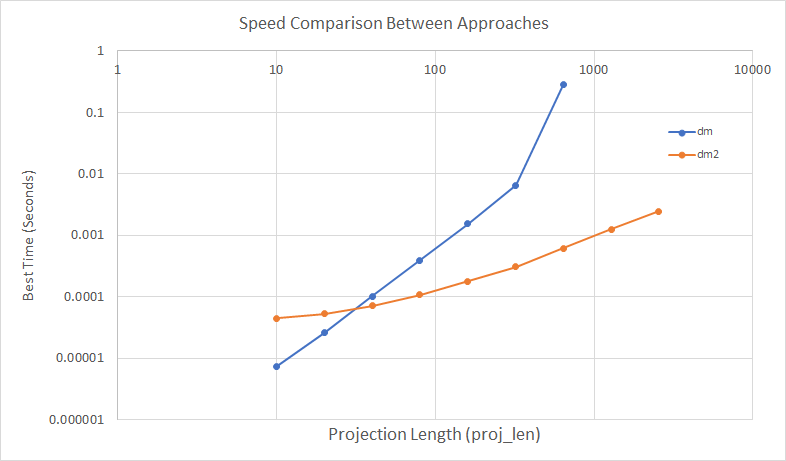

# Pythonic Heavy Modelling

## Primary Motivation / Problem Statement

Heavy models are models which are complex to compute, where values likely to be contingent; that is where the value at each timepoint *t* depends on the values at *t-1*, *t-2* etc. through to *t=0*.

This contingency can result in even a simple model causing stack overflows and other nastiness.  Fortunately there are solutions, this document outlines one approach using the *heavymodel* library I have developed in Python.

A trivial example is would be a value which starts at 1 at *t=0*, and reduces by 5% at each subsequent time point.  Without using the heavymodel library this could be written as:

```python
class DecreasingModel():
    def var(self, t):
        if t==0:
            return 1
        else:
            return self.var(t-1) * 0.95
```

This example could be run as follows:

```python
dm = DecreasingModel()
results = {t:dm.var(t) for t in range(0, 11)}
```

As expected, this gives results as follows:

```python
{0: 1,
 1: 0.95,
 2: 0.9025,
...

 9: 0.6302494097246091,
 10: 0.5987369392383786}
```

As it is recursive `dm.var(10)` will be called once, `dm.var(9)` will be called twice, `dm.var(0)` called 11 times, in total 66 calls.&nbsp; For *t=n*, the total calls is *n(n+1)/2*, i.e. O(n²);  If we were to introduce multiple dependent functions the number of computations would grow exponentially.
We can see the speed using the ipython magic function %timeit:

```python
In [6]: %timeit results = {t:dm.var(t) for t in range(0, 20)}
10000 loops, best of 3: 25.2 µs per loop

In [7]: %timeit results = {t:dm.var(t) for t in range(0, 120)}
1000 loops, best of 3: 871 µs per loop
```


To an actuary writing model and expecting execution similar to Excel, this can be a nasty surprise, and result in programming languages being rejected.


To minimise run speed (and avoid recursion and stack overflows), we want to evaluate each function at most once.


The solution can be achieved by inheriting from the `Model` class in the `heavymodel` library, which provides functionality to evaluate the user model.  The example above can be rewritten as:


```python
from heavymodel import Model
class DecreasingModel2(Model):
    def var(self, t):
        if t==0:
            return 1
        else:
            return self.var(t-1) * 0.95
```


`Model` supplies a helper method `_run` which evaluates the model at each time point from t=0 to t=proj_length-1 (as python is zero-indexed):


```python
dm2 = DecreasingModel2()
dm2._run(proj_length=11)
results = dm2.var.values   # results are stored in the .values attribute
```

Results are identical to the first case:


```python
{0: 1,
 1: 0.95,
 2: 0.9025,
...
 9: 0.6302494097246091,
 10: 0.5987369392383786}
```

Timings are outlined in the section below.


**Aside:** The `_run` method is provided by the `heavymodel.Model` class, which is inherited by the user model class.  It's implementation may vary but its purpose is to calculate each single argument user method starting from *t=0* up to *proj_length-1*.


## Speed comparison of the two methods

Timing dm2._run() is complicated by the fact that after the first run, results are stored for that instance.  To provide a like-for-like comparison we need to create a new instance of the model for each evaluation:


```python
def dm_time(proj_len):
    dm = DecreasingModel()
    results = {t:dm.var(t) for t in range(0, proj_len)}
    return results

def dm2_time(proj_len):
    dm2 = DecreasingModel2()
    dm2._run(proj_len)
    return dm2.var.values
```

Using `%timeit` over a series of values of proj_len allows us to measure the relative speeds, for example for `proj_len=70`.

```python
In [72]: %timeit dm_time(70)
1000 loops, best of 3: 284 µs per loop

In [73]: %timeit dm2_time(70)
10000 loops, best of 3: 99.7 µs per loop
```

A log-log plot of results is below.  We can see that dm2 (the model using `heavymodel.Model`) has an increased initialisation time, but for projection lengths greater than 50(ish), `dm2` becomes substantially quicker.  At *proj_len* equal to 1280 and 2560, `dm` failed due to a RecursionError.




Given that most heavy models are likely to be run monthly for at least 20 years, a typical proj_len will be 240 or greater, and so the *heavymodel* approach should give substantial speed benefits.

If you are interested in other approaches, I recommend the [OpenActuarial site](https://open-actuarial.readthedocs.io/en/latest/index.html).
