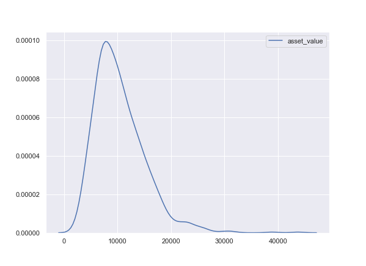

# Stochastic Modelling

The below code generates 1000 simulations over a 60 year period for an asset which has returns normally distributed with mean 0.04 and standard deviation 0.06. This produces a density plot as follows:

<center></center>

```python
from heavymodel import Model, Data

import random
import pandas as pd
import seaborn as sns
sns.set()

rng = random.Random(0) # seed set to ensure replicable.

class Asset(Model):
    def asset_value(self, t):
        if t == 0:
            return self.initial_fund
        else:
            return self.asset_value(t-1) * (1 + self.inv_growth(t))
    
    def inv_growth(self, t):
        return rng.normalvariate(self.mu, self.sigma)

data = Data(dict(mu=0.04, sigma=0.06, initial_fund=1000))
   
simulations = 1000
results = []

for count, sim in enumerate(range(simulations)):
    asset = Asset(data=data)
    asset._run(61)
    results.append(asset.asset_value(60))
    
result_df = pd.DataFrame(data={"asset_value":results})
sns.kdeplot(result_df["asset_value"])
```


